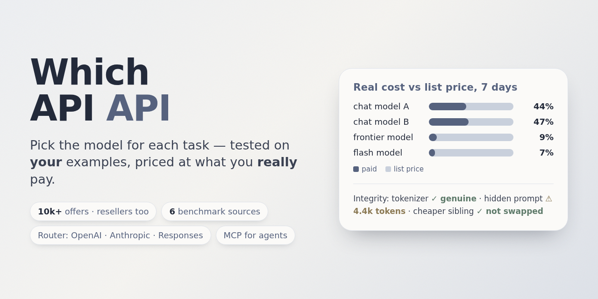

# Which API API



**Pick the right API for your automation — tested on your own tasks, priced for your real load.**

> Status: v0.3 — evaluator, MCP/REST, offers + benchmarks, non-LLM (search, speech-to-text), automation audit
> (n8n, Make, code) and a task-aware model picker are done; applying changes to automations is next.
> License: AGPL-3.0.

Describe a task (text, voice, or an existing n8n workflow). Which API API figures out which capabilities it
needs (`llm.chat`, `search.web`, `speech.stt`, `geo.geocode`, `transit.realtime`, …), finds every way to buy
each one — official providers, aggregators, resellers, your own channels — with their real conditions
(batch, cache, off-peak, data-sharing discounts, top-up fees, KYC, geo-blocks), **runs the candidates on your
examples**, and recommends a primary option plus a fallback from a different provider. Later phases implement
the choice directly in your automation.

Core idea: **don't reinvent** — data, evals and catalogs come from open sources
([models.dev](https://models.dev), OpenRouter, LiteLLM price data, new-api resellers, APIs.guru, MCP Registry…).
The value is the glue: normalised offers with provenance, cost for *your* load profile, and evaluation on *your* tasks.

## Quick start

```bash
uv sync
uv run whichapiapi offers pull all                 # ~10k offers: models.dev, OpenRouter, DeepInfra, HF router, Eden AI
uv run whichapiapi offers pull-benchmarks          # LMArena, Open ASR, SWE-bench, BFCL (+ Artificial Analysis with a free key)
uv run whichapiapi models rank -p optimal          # best model variants: quality, cost per task, speed
uv run whichapiapi audit n8n --docker n8n          # read-only audit of your n8n workflows
uv run pytest -q
```

Docker: `docker build -t whichapiapi . && docker run -e WHICHAPIAPI_MCP_TOKEN=... -p 8765:8765 -v wa:/data whichapiapi`
(MCP at `/mcp`, read-only REST at `/api/offers`, `/api/rank`, `/api/models/<model>/benchmarks`, `/api/audit/n8n`).

### Pick a model for a task

`whichapiapi models rank -p coding` (or MCP `rank_models`, REST `/api/rank`) ranks every model *variant* — reasoning
effort included — by a task-specific quality blend of benchmark percentiles, **cost per task** that counts the
thinking tokens a variant spends before answering, and speed. 14 presets: best, optimal, value, fast, ultrafast,
realtime, coding, math, agents, russian, writing, vision, long_context, open. `whichapiapi models page picker.html`
builds the interactive picker (sliders for quality / cost / speed). Method and limits: [docs/SELECTION.md](docs/SELECTION.md).

### Audit an automation

`whichapiapi audit n8n <export.json> | --docker <container>`, `audit make <blueprint.json>`, `audit code <dir>` (MCP
`audit_n8n`): every AI call is checked for overpay (same model cheaper elsewhere), cheaper models with an
equal-or-better benchmark score, missing fallback, training-data risk, deprecated/unknown models and API keys
written into the automation. `audit n8n-suite <node>` turns a node into an eval suite so a suggested switch is
tested on that node's own inputs first.

### Use it from an agent (MCP)

```bash
claude mcp add whichapiapi -- uv run --project /path/to/which_apiapi whichapiapi mcp
```

Tools: `rank_models`, `audit_n8n`, `find_offers`, `compare_prices`, `estimate_cost`, `learned_prices`, `pull_offers`,
`pull_benchmarks`, `benchmark_boards`, `model_benchmarks`, `pull_conditions`, `conditions_priors`, `cross_check_price`,
`eval_plan`, `run_eval`, `run_canary` (`run_eval`/`run_canary` spend money within a hard budget — the agent
is told to ask first). Streamable HTTP: `whichapiapi mcp --http` (127.0.0.1:8765/mcp).

### Evaluate candidates on your own task

Write a suite (promptfoo-compatible YAML) with deterministic checks and an LLM rubric — or let an agent draft one
(MCP `create_suite`, `suite_from_traces`); see `examples/canary/` for a small one. `whichapiapi eval plan|run|learn|reconcile|report`.
Real cost is read from the channel's own call log when available (new-api resellers), so reports show
*list price* vs *what you were actually charged*.

### Canary suite: catch a channel silently substituting the model

```bash
uv run whichapiapi eval canary examples/canary/suite.yaml   # ~$0.0005/run
```

5 cheap, deterministic cases (no LLM judge) run repeatedly and get diffed against a stored per-provider
baseline; `alerts` flags a pass-rate/score drop or a latency spike. A clean run refreshes the baseline; a run
WITH alerts does not, so a regression can't quietly become "normal" — re-run with `--reset-baseline` once
you've reviewed it. It exits with code 2 on alerts; systemd/cron recipes: [docs/OPERATIONS.md](docs/OPERATIONS.md).

### Optional: watch pricing pages with changedetection.io

`whichapiapi mcp --http` also serves a webhook at `/webhooks/changedetection` that records "this pricing page
changed" notifications (self-hosted, never spends money, never auto-refetches — it just tells you which
`offers pull*` to re-run). To wire it up:

1. Run [changedetection.io](https://github.com/dgtlmoon/changedetection.io) yourself (`docker run
   ghcr.io/dgtlmoon/changedetection.io`) and add a watch per pricing page you care about.
2. On that watch, set the notification URL to `json://<host>:8765/webhooks/changedetection` (or `jsons://`
   for TLS) and the notification body to a JSON template, e.g.:
   ```json
   {"watch_url": "{{watch_url}}", "watch_uuid": "{{watch_uuid}}", "watch_title": "{{watch_title}}",
    "diff_added": "{{diff_added}}", "diff_removed": "{{diff_removed}}"}
   ```
   (token names verified against changedetection.io's own notification context, not guessed). The endpoint
   accepts this JSON directly at the top level, or nested as a string under `body`/`message` — Apprise's
   exact wrapping for `json://`/`jsons://` wasn't confirmed from its docs, so both forms are handled
   defensively rather than assumed.
3. `whichapiapi offers price-changes` (CLI) or `price_change_alerts` (MCP tool) lists what came in, newest
   first, with any of our offers whose source domain matches the changed page.

### Non-LLM capabilities

The evaluator and selector are capability-agnostic. Real transports: Tavily (`search.web`, keyword + LLM-judged
relevance, `examples/search/suite.live.yaml`), OpenAI-compatible transcription (OpenAI, Groq, new-api resellers) and
Deepgram (`speech.stt`, `examples/speech_stt/suite.live.yaml`; WER with OpenAI Whisper's normalizers).

## Custom providers

Which API API works with custom providers that have their own pricing — resellers, gateways, self-hosted
OpenAI-compatible endpoints. Describe them once, outside the repository, in `~/.config/whichapiapi/channels.yaml`
(or `$WHICHAPIAPI_CHANNELS`); keys stay in environment variables:

```yaml
myreseller:
  base_url: https://api.example.com/v1
  key_env: MYRESELLER_API_KEY
  kind: newapi        # new-api/one-api: price groups, per-call log → real cost, balance forecast
  primary: true       # default channel for judges, the balance forecast and the dashboard
  judge_model: some-model
```

Then `myreseller:<model>` works everywhere (suites, router, integrity checks), offers come from `whichapiapi offers
pull newapi --url … --channel myreseller`, and real per-call cost is measured from its log. Your own keys for
official free tiers go to the encrypted pool: `whichapiapi providers add groq`.

## Documentation

| Doc | What |
|---|---|
| [docs/ARCHITECTURE.md](docs/ARCHITECTURE.md) | Modules, data model, flows, extension points |
| [docs/SELECTION.md](docs/SELECTION.md) | How model variants are scored (quality, cost per task, speed) |
| [docs/OPERATIONS.md](docs/OPERATIONS.md) | Scheduled refresh and canary (systemd / cron) |
| [SECURITY.md](SECURITY.md) | Trust model: suites are code, MCP/REST auth, secrets |
| [CHANGELOG.md](CHANGELOG.md) | Releases |
| [docs/ROADMAP.md](docs/ROADMAP.md) | Phases and exit criteria |
| [docs/PRIOR_ART.md](docs/PRIOR_ART.md) | What we reuse from GitHub and why |
| [docs/adr/](docs/adr/) | Architecture decisions |

## Data attribution

Price and catalog data come from third-party sources, each credited in reports:
models.dev (MIT), OpenRouter, DeepInfra, Hugging Face Inference Providers, Eden AI, LiteLLM (MIT), InferIndex,
LMArena (CC BY 4.0), [Artificial Analysis](https://artificialanalysis.ai/) (attribution required), Hugging Face Open
ASR Leaderboard, SWE-bench (MIT), BFCL (Apache-2.0). Speech test clips: LibriSpeech and FLEURS (CC BY 4.0), downloaded
locally, never committed. WER normalizers vendored from OpenAI Whisper (MIT). Free-tier limits from the
[FreeLLMAPI](https://github.com/tashfeenahmed/freellmapi) catalog (MIT, freellmapi.co); several router mechanisms are
adapted from FreeLLMAPI's design. Full notices: [THIRD_PARTY_NOTICES.md](THIRD_PARTY_NOTICES.md).
